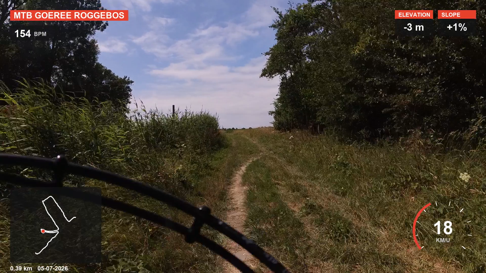
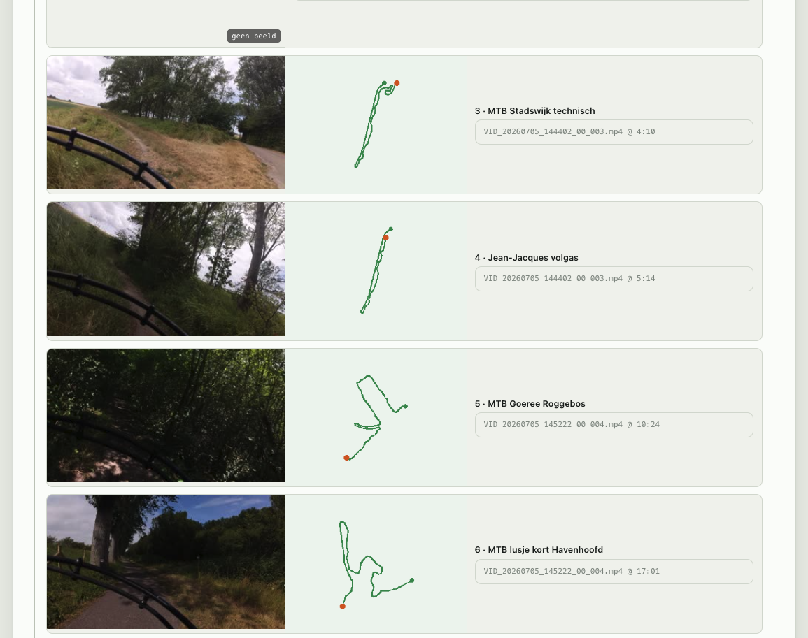

# 🚵 ride-highlight-editor

Turn raw mountainbike action-cam footage into a polished highlight video —
automatically. Drop in your clips and a Strava ride (or a GPX file), and the tool
finds the good bits, overlays live telemetry, adds an intro and music, and renders
a shareable reel. Point-and-click GUI or one CLI command. Camera-agnostic
(Insta360, GoPro, phone — anything).



## What it does

- **Finds your highlights** — uses your **Strava segments** (medals / PRs / starred)
  as highlights, or falls back to automatic **speed & motion** detection.
- **Live telemetry HUD** on every clip — segment name, heart rate, elevation + slope,
  a speedometer, and a mini-map with a moving position dot, drawn from per-second
  GPS/Strava data (adds power when available).
- **Cinematic intro** — an animated title card: the curviest clip of the ride plays
  behind a route map that draws itself in, with distance, time, avg speed, elevation.
- **Adaptive background music** — point at a folder of tracks; they play back-to-back
  with short crossfades, loop to fill the whole video, and fade out at the end.
- **Multiple clips, one ride** — hand it several video files that jointly cover the
  ride; each is placed on the timeline by its own recording time and only the parts
  you actually filmed get rendered.
- **Visual alignment GUI** — drag the sync-offset and watch, per segment, the **start
  frame** and the **GPS track** update live so you can line footage up to the ride.
- **Sensible defaults** — clips in `video_input/`, renders to `video_output/`, and
  output files auto-named `<activity>_<date>.mp4`.



## Requirements

- macOS (primary target; the CLI/GUI are cross-platform where FFmpeg + Python run)
- Python 3.11–3.14
- FFmpeg:

  ```bash
  brew install ffmpeg
  ```

## Setup

```bash
python3 -m venv .venv
source .venv/bin/activate
pip install -r requirements.txt
```

> Python 3.14 is new; if `opencv-python`/`moviepy` wheels aren't available for your
> interpreter yet, use Python 3.11 or 3.12 in the venv.

## Quick start

### The GUI (easiest)

```bash
python gui.py
```

This starts a local server on `127.0.0.1` and opens the **Ride Highlight Editor** in
your browser. It's a friendly front end over the same pipeline as the CLI — it builds
the equivalent `main.py` command for you and streams the render live:

1. **Source videos** — pick a folder or add individual files (native file dialog).
2. **Strava activity** — pick a recent ride; or, if Strava isn't set up, choose a GPX file.
3. **Align to the track** — drag the shared sync-offset (or hit **Auto-align**) and watch,
   per segment, the start frame and GPS track update against the ride's speed profile.
4. **Music** — pick a music folder; sub-folders with tracks appear as chips.
5. **Output & render** — set folder/filename, mode, resolution, choose which segments to
   include, and hit **Start render**. The exact command and its live output show at the
   bottom; **Stop** cancels a run.

### The CLI

```bash
# Put clips in video_input/, render to video_output/ using your Strava segments:
python main.py --strava --strava-activity-id 1234567890 --mode segments

# Explicit files + music + a custom name, rendered at source (4K) resolution:
python main.py --video clip1.mp4 clip2.mp4 --gpx ride.gpx \
    --music ./music/rock --output-height source --output myrun.mp4

# Just see what it would do — print the detected segments, render nothing:
python main.py --strava --strava-activity-id 1234567890 --mode segments --dry-run
```

Without `--output` the file is named `<activity>_<YYYY-MM-DD>.mp4` in `--output-dir`
(default `video_output/`). `--video` defaults to `video_input/` and also accepts a folder.

## Graceful by default

The pipeline is built to keep going and tell you what it did, rather than fail hard:

- **No Strava?** Pass `--gpx ride.gpx` (a Strava or Garmin export). A supplied `--gpx`
  always wins; with `--strava-activity-id` and Strava configured, the track is built
  straight from the activity's GPS/altitude/HR streams — no GPX file needed.
- **Wrong/missing video timestamp?** Sync falls back `creation_time` → filename
  (`VID_YYYYMMDD_HHMMSS`) → file mtime, and warns when it's approximate. Fix it with
  `--inspect` + `--auto-sync`, or set `--sync-offset` by hand (the GUI makes this visual).
- **A picked segment has no footage?** It's dropped with a `geen video voor: …` warning;
  the rest still renders. With several clips, only ride portions you actually filmed render.
- **HUD render hiccups?** The clip falls back to a simple lower-third caption.
- **Music can't be built/mixed?** The video renders without music (with a warning).
- **Clips of different resolutions?** Each is scaled to the target output height.
- **Strava/Garmin stats not configured?** They're skipped; the pipeline continues with
  GPX-only stats.

## Highlight modes

`--mode auto` (default) uses Strava segments when available, else speed/motion detection.

```bash
# Segment mode: one clip per noteworthy segment (medal/PR/starred), with a telemetry
# HUD. Needs Strava configured + an activity id:
python main.py --gpx ride.gpx --strava --strava-activity-id 1234567890 --mode segments

# Classic speed/motion mode:
python main.py --gpx ride.gpx --mode flow
```

In segment mode each clip carries the animated **HUD**; disable it with
`hud_enabled = False` in `config.py` for a plain lower-third caption. When Strava is
configured, the HUD is fed by Strava's per-second **streams** (smoothed speed, HR,
power, grade) — more accurate, and it adds a power readout; missing streams fall back
to the GPX data per field.

Output is 1080p by default. Render at source resolution (e.g. 4K) with
`--output-height source`, or a specific height like `--output-height 1440`; width
follows the source aspect and the HUD scales with it. The heavy encodes show a live %.

## Multiple video files

`--video clip1.mp4 clip2.mp4 clip3.mp4` (or a folder) covers one ride with several files.
Each is placed on the ride by its recording time, and their relative spacing (same
camera) is trusted. `--sync-offset` **anchors the earliest-recorded file** — the same
absolute meaning it has for a single file — and the others follow by their recording-time
deltas, so one value corrects a constant camera-clock skew. Only ride portions with
footage are rendered (uncovered segments are dropped with a warning); `--pick 1,3,4`
selects segments by the numbers shown in `--dry-run` / the GUI. One `--video` file behaves
exactly as before.

## Music

`--music ./music/` (a folder) or `--music track.mp3` (a single file). Folder contents are
sorted by filename (`.mp3/.m4a/.aac/.wav`), played back-to-back with short crossfades,
looped to fill the whole video, and faded out at the end — mixed under the entire video
(intro included) with the original audio quiet beneath. Point `--music` at a specific
sub-folder (e.g. `music/rock`) to pick a style. The bundled `music/` samples were
generated with MusicAPI (user-owned, no attribution required — see
[`music/CREDITS.md`](music/CREDITS.md)).

## Fixing sync (copied videos with wrong timestamps)

If a video's `creation_time` was altered by copying, the GPX↔video alignment drifts and
too much footage is kept:

```bash
# See the offset sources + aligned speed/motion sparklines:
python main.py --video ride.mp4 --gpx ride.gpx --inspect

# Let cross-correlation pick the offset:
python main.py --video ride.mp4 --gpx ride.gpx --auto-sync

# Or set it by hand (video_t → activity_t + offset):
python main.py --video ride.mp4 --gpx ride.gpx --sync-offset 137.5
```

Precedence: `--sync-offset` > `--auto-sync` > file timestamp. The GUI's alignment view is
the visual version of this — drag until the start frames match where you expect to be.

## Optional: Strava

Strava unlocks the activity picker, segment highlights, and the richer streams-based HUD.

1. Create an API app at <https://www.strava.com/settings/api>:
   - **Website:** anything (e.g. `http://localhost`)
   - **Authorization Callback Domain:** `localhost` (just the domain — no `http://`, no port)

   Note the **Client ID** and **Client Secret**.

2. Export the credentials and run the one-time OAuth helper (it opens your browser,
   catches the redirect, and writes `.strava_token.json`):

   ```bash
   export STRAVA_CLIENT_ID=xxxxx
   export STRAVA_CLIENT_SECRET=xxxxx
   python strava_auth.py            # or: python strava_auth.py --port 8721
   ```

3. Run with `--strava` (tokens refresh automatically after that; `.strava_token.json` is
   gitignored). To use the activity picker in the GUI, launch it in the same shell where
   the credentials are exported.

## Tests

```bash
python -m pytest test_sync.py -v
```

## Troubleshooting

- **"ffmpeg not found"** → `brew install ffmpeg`.
- **Segments look off by a second or two** → the video's `creation_time` may be missing
  (falls back to file mtime); prefer footage with intact metadata, or set `--sync-offset`.
- **GUI shows "Strava niet beschikbaar"** → Strava isn't configured in that shell; export
  the credentials before `python gui.py`, or use the "Choose GPX file" option.
